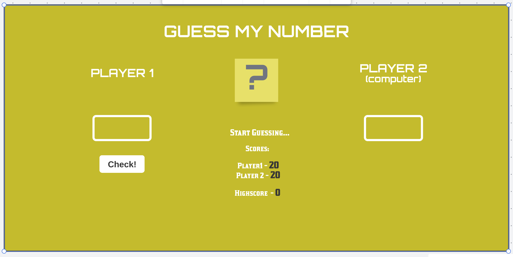
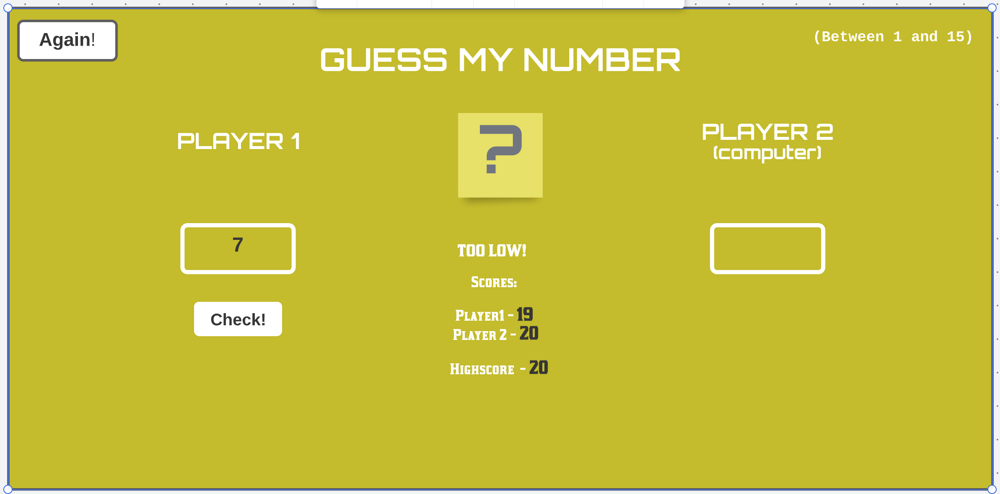
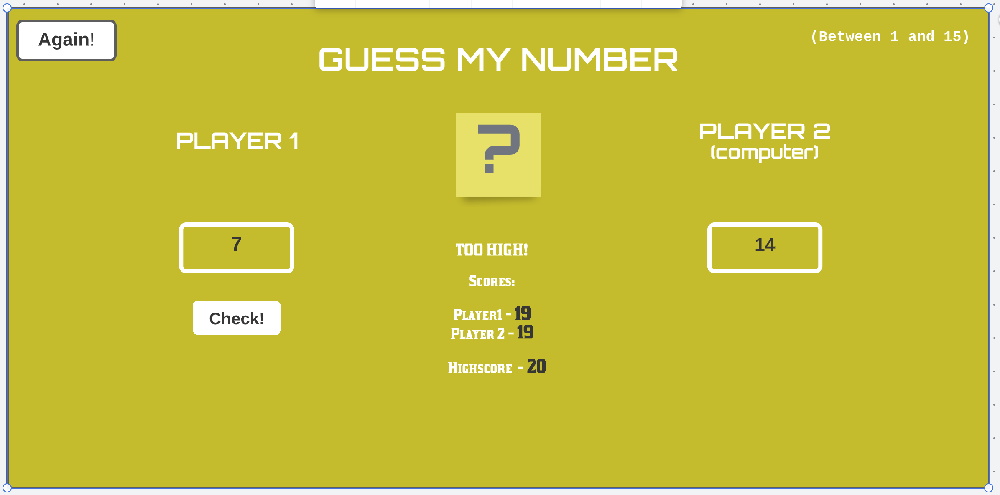
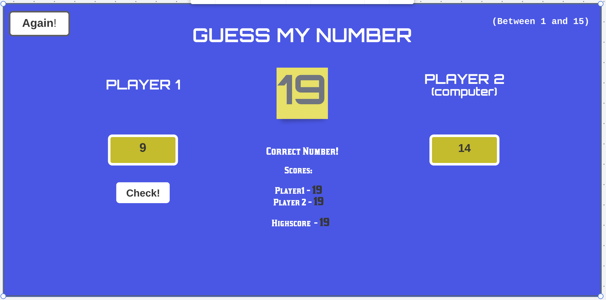
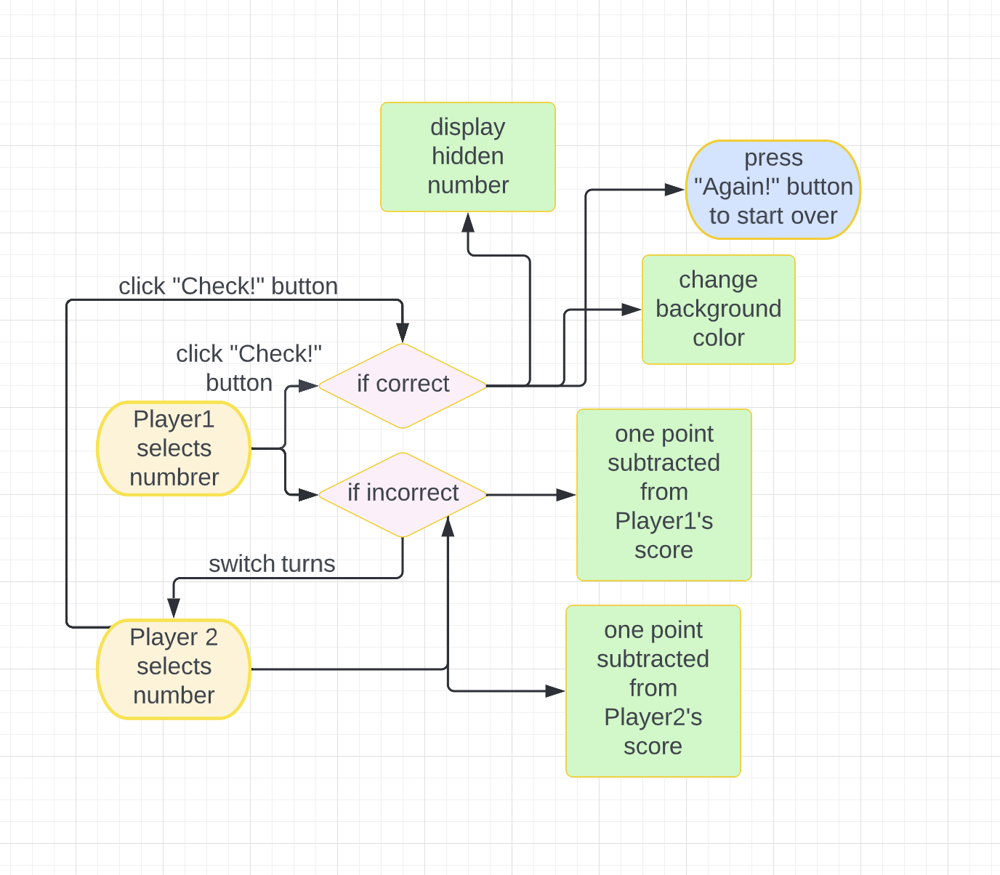

# Guess My Number

- This version of game is played by **two players** (you against the computer).

- **The winner** is the one who has a higher score. Background color of the screen changes to blue (Hex #4256e9) once **a win** state has been reached. Initial background color is Hex #c9bc05.

- **One or multiple rounds** to play is available with the highest score saved on the screen.

## The Original Guess My Number Game

- [The link to the original game](https://portfolio-netlify2.netlify.app/)

- Game will be built by me from the scratch and modified.

### Stages of the game:

1. Beginning.
2. Player 1 starts and gets it wrong.
3. Player 2 proceeds and gets it wrong.
4. Player 1 gives it another try and wins.
5. Flowchart.
